# Nixie-Uhr

So eine Uhr mit [Nixie-Röhren](https://de.wikipedia.org/wiki/Nixie-R%C3%B6hre) ist schon ein "Hingucker"!

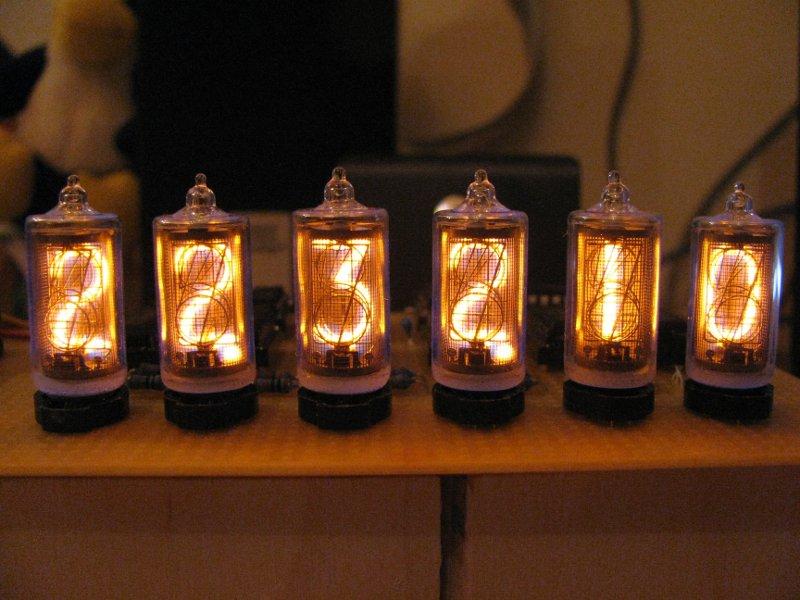
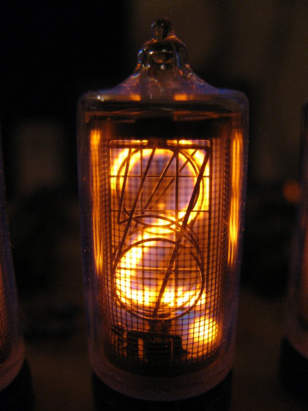

## Version 1 (ATMEGA8; DCF77)
Die [erste Version meiner Nixie-Uhr](Version1/) entstand im Jahr 2012. Die Steuerung hatte ein Atmel [ATMEGA8](https://ww1.microchip.com/downloads/en/DeviceDoc/Atmel-2486-8-bit-AVR-microcontroller-ATmega8_L_datasheet.pdf) übernommen. Als Zeitbasis, für die genaue Uhrzeit, wurde ein [DCF77](https://de.wikipedia.org/wiki/DCF77)-Modul verwendet, welches via [I2C](https://de.wikipedia.org/wiki/I%C2%B2C) angebunden war. Alternativ konnte die Uhrzeit mittels Taster eingestellt werden. Weiterhin wurde ein Photo-Widerstand zum Ausschalten der Nixie-Röhren bei Dunkelheit und eine Steuerung via IR-Fernbedienung (nicht im Schaltplan enthalten) integriert.
Weitere Informationen können auch dem entsprechenden Quelltext entnommen werden ;-)...

Schaltplan Version 1:

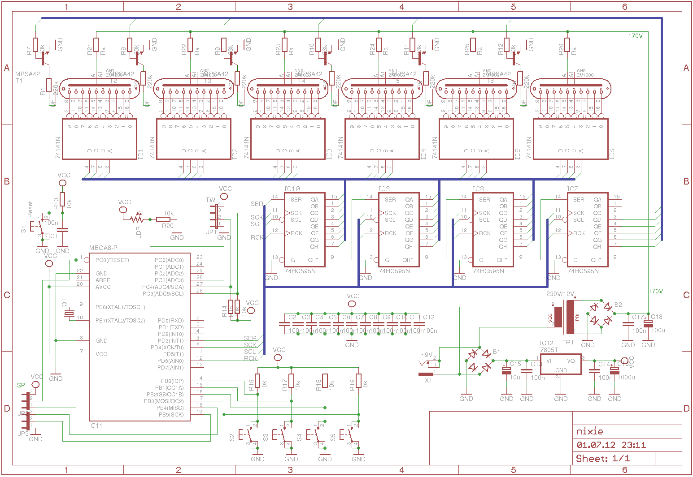

Der Aufbau erfolge auf Lochrasterplatinen:

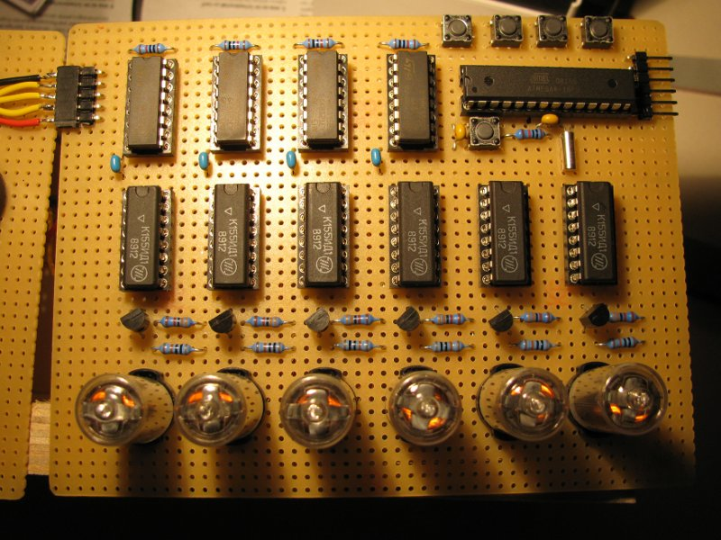
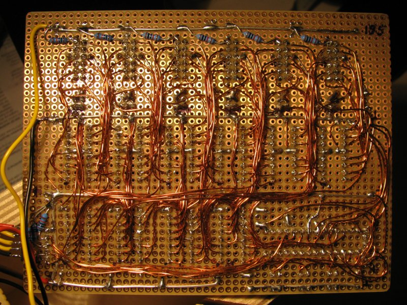
 
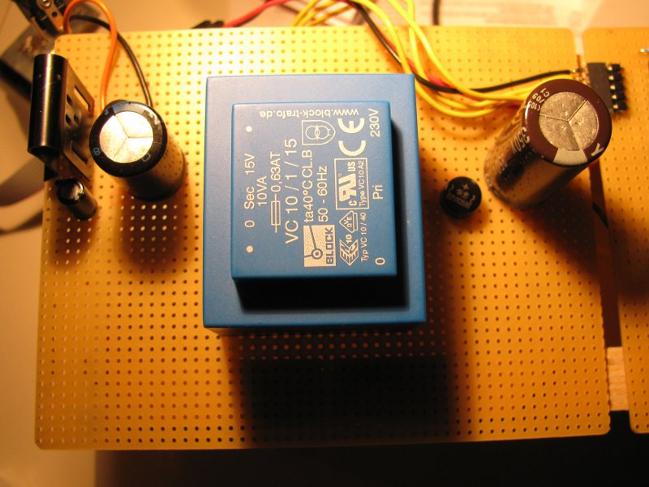
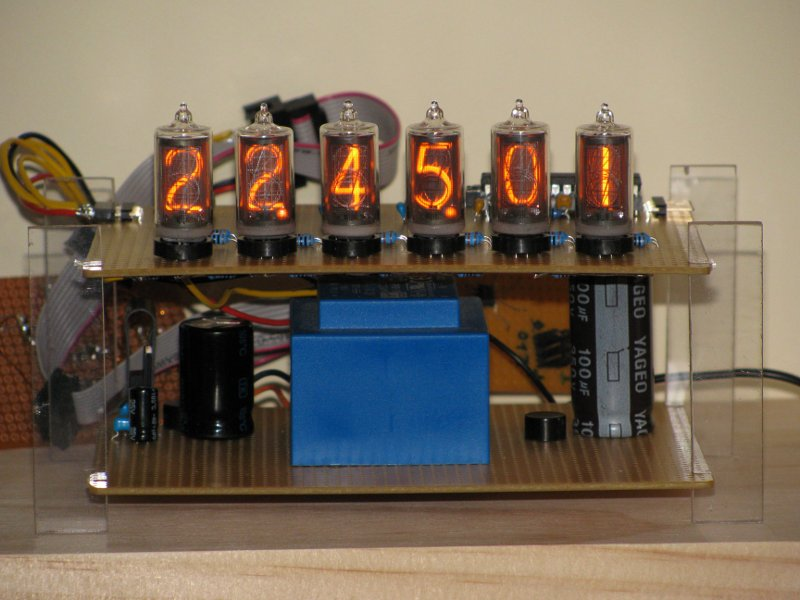

## Version 2 (ESP8266; WLAN, NTP, MQTT)
Irgendwann wurde das DCF77-Signal am Standort der Nixie nicht mehr zuverlässig empfangen. Die Ganggenauigkeit der Uhr, ohne regelmäßige Synchronisation mit einer Zeitbasis, ist unterirdisch. Die Eingabe/Korrektur der aktuellen Uhrzeit mit den Tastern macht auch keinen Spaß! Deshalb eine neue Nixie-Uhr bauen?

Nein! Zum Glück habe ich damals das Herz der Uhr, den ATMEGA8, auf der Lochrasterplatte gesockelt. Es entstand die Idee zu einer [zweiten Version](Version2/), bei der der Mikrokontroller einfach durch einen [ESP8266](https://de.wikipedia.org/wiki/ESP8266) ausgetauscht wird. Der ESP ist mit dem heimischen WLAN verbunden und übernimmt das Holen der aktuellen Uhrzeit via [NTP](https://de.wikipedia.org/wiki/Network_Time_Protocol), welche dann, entsprechend aufbereitet, an die Schieberegister (4 x 74HC595; siehe Schaltplan) ausgegeben wird. Zur Steuerung des Ausschaltens der Nixie-Röhren bei Dunkelheit, wird ein Lichtsensor vom Typ [BH1750](https://wolles-elektronikkiste.de/bh1750fvi-lichtsensormodul) verwendet, welcher via I2C vom ESP abgefragt wird. Die Umsetzung von 3,3V- in 5V-Logik erfolgt mittels geeigneter Pegelwandler. Die Verbindung dieses Moduls mit der bestehenden Nixie-Schaltung erfolgt über den IC-Sockel des alten ATMEGA8, der natürlich vorher aus selbigen entfernt wird.

Schaltung ESP-Modul (sorry für das Fritzing-Bildchen :-)...); Aufbau auf Lochraster:

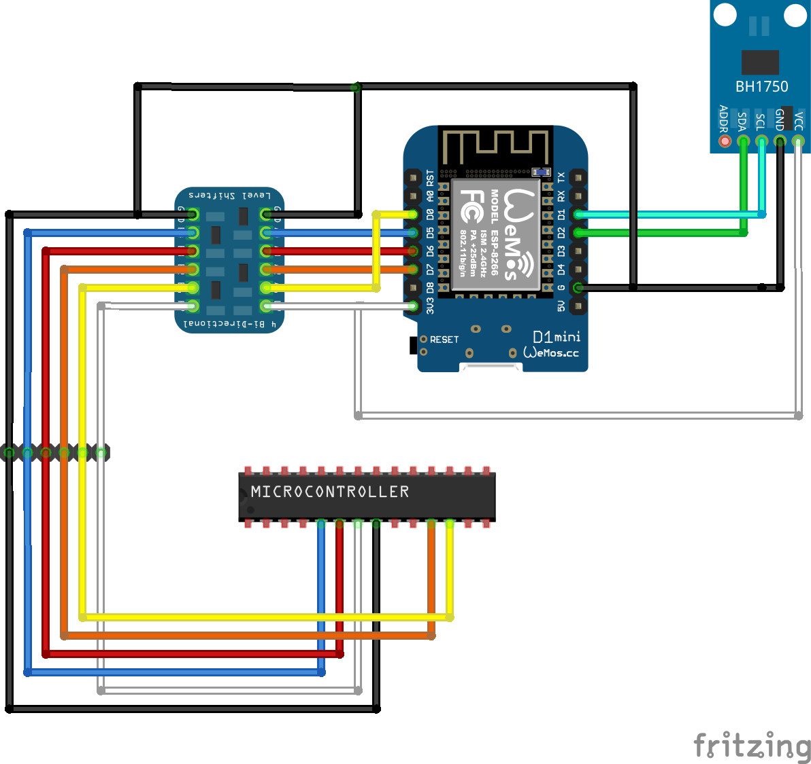
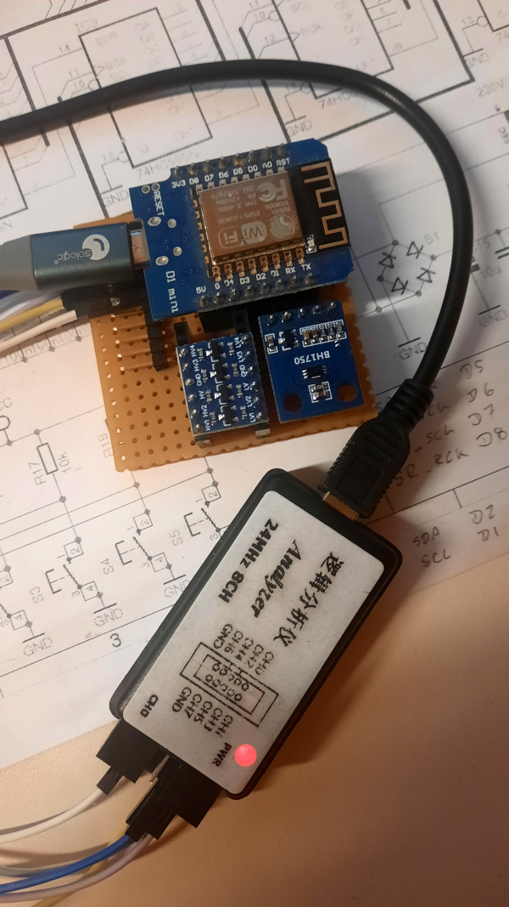

Verbindung mit dem IC-Sockel der MCU auf alter Nixie-Lochraster:
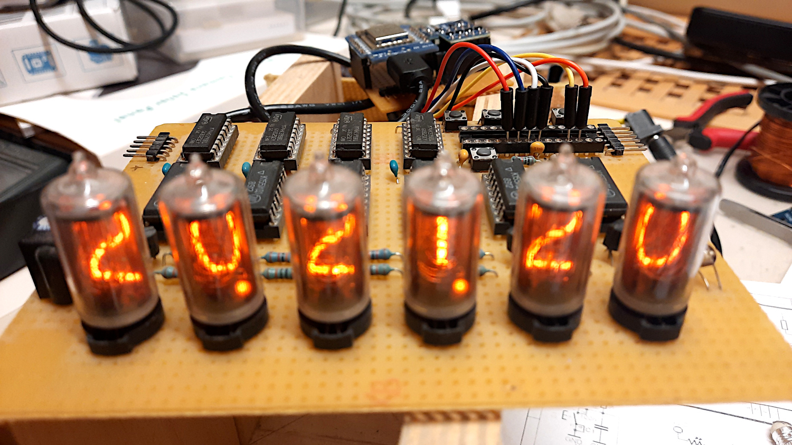

Und wenn wir uns mit dem ESP schon im Netzwerk befinden: die Fernsteuerung der Uhr kann über MQTT-Nachrichten erfolgen (siehe entsprechende Einzelheiten dazu im Quelltext...).

Und damit meine Nixie-Uhr nicht wieder einstaubt, habe ich ihr bei der Gelegenheit noch ein schickes Gehäuse spendiert:

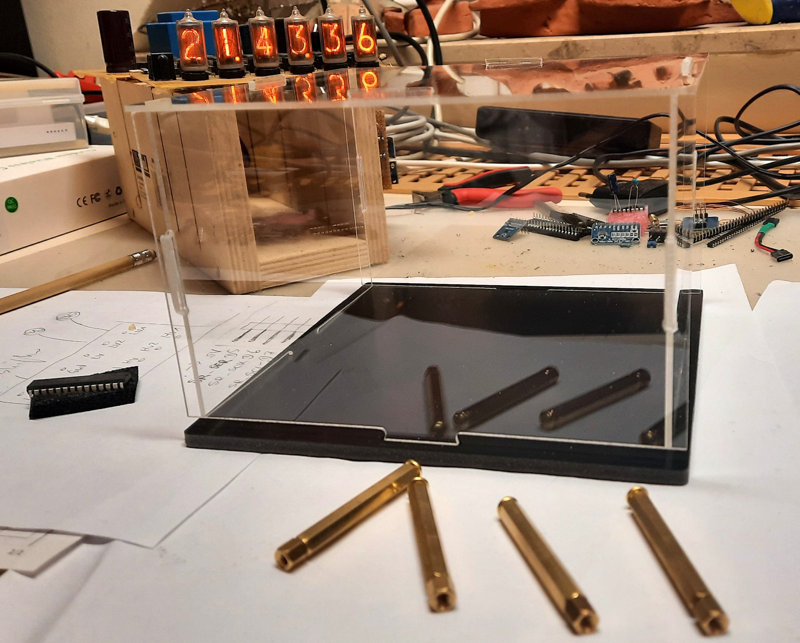

(erstmal das Gehäuse noch leer und die Uhr dahinter; es muss noch ein wenig "Mechanik" gemacht werden und die alten Leiterplatten entstaubt werden ;-)...)

---
Uwe Berger; 2012; 2026